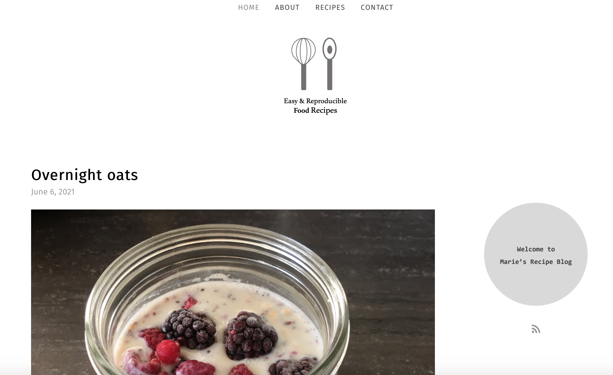

# Recipe Blog

Visit my Recipe Blog at [https://masadler.github.io/Recipes/](https://masadler.github.io/Recipes/)!

# Acknowledgement

Food/baking blog template for Jekyll forked from `CloudCannon/treat-jekyll-template`. 

Demo of the original template can be found [here](https://spring-bat.cloudvent.net/).

Treat was made by [CloudCannon](http://cloudcannon.com/), the Cloud CMS for Jekyll.

Find more templates, themes and step-by-step Jekyll tutorials at [CloudCannon Academy](https://learn.cloudcannon.com/).
